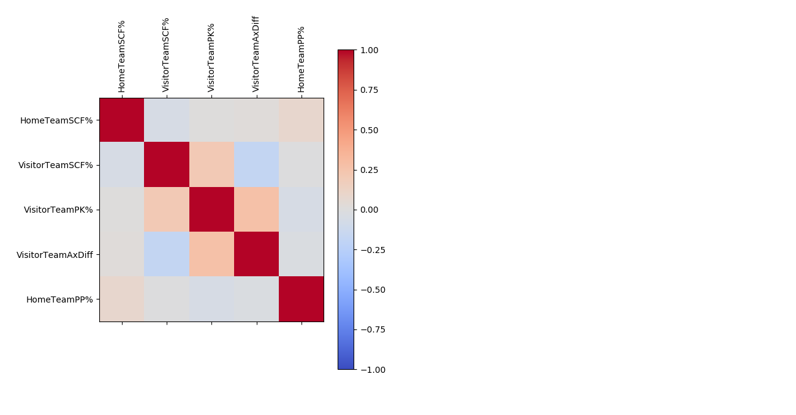
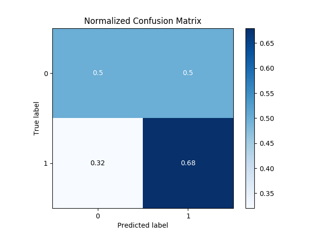
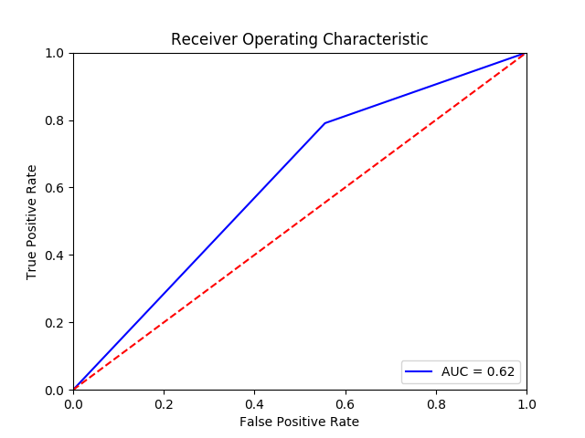

<h1>NHL Logistic Regression Model for Game Prediction</h1>

The model I created uses only publicly available NHL statistics, available on *http://www.hockey-reference.com/*.
The accuracy on the model ranges from 63-65% on the 2018-2019 season, and introduces no bias in the data since it is based on
historical statistical data from a previous season. 

The model includes:
1. A Logistic Regression model for binary classification
1. Kfolding for cross-validation of the data
1. Use of a standard scaler to scale and normalize data
1. Label encoder for encoding labels

<h2>Model Metric Graphs</h2>

<b>*Variable Correlation Heatmap*</b>

    

<b>*Confusion Matrix Heatmap*</b>

    

<b>*ROC Curve*</b>

    

